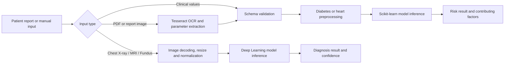

<div align="center">
  <h1>MedSynapse: Agentic LLM Orchestration of Multi-Disease Diagnostic Models 🏥</h1>
  <h3>A Unified Framework for Explainable, Confidence-Aware, and Guideline-Grounded Medical Reporting</h3>

  <p><i>"Bridging Fragmented Single-Disease Classifiers into an Autonomous, Multi-Modal Agentic Diagnostic System with Fused Multi-Method Explainability (XAI)"</i></p>

  <div>
    
    
    
    
    
    
  </div>
</div>

---

## 📖 Research Abstract & Clinical Motivation

Modern healthcare AI systems largely operate as isolated, single-disease classifiers that output raw, uncalibrated probability scores without clinically interpretable context. In real clinical workflows, patients rarely present with a single, neatly isolated concern, and clinicians require transparent evidence, counterfactual reasoning, and guideline alignment rather than black-box probabilities.

**MedSynapse** introduces an **agentic, multi-modal diagnostic framework** unifying **nine disease-specific machine learning and deep learning modules**—spanning metabolic, cardiovascular, pulmonary, neuro-oncological, oncological, hepatic, renal, dermatological, and ophthalmic domains—under a single coordinating Large Language Model (LLM) agent and a real-time clinical screening portal.

The system ingests **multi-modal patient inputs** (clinical text, spoken audio, radiologic/photographic imaging, and lab reports), dynamically routes queries to the relevant disease backbones, and enriches predictions through a **fused multi-method explainability layer (SHAP, LIME, Grad-CAM, counterfactuals)**. The LLM agent synthesizes cross-module correlations (e.g., linking diabetic and renal risk signals), grounds findings in clinical guidelines, and generates a calibrated, confidence-aware clinical summary with quantified hallucination safeguards.

---

## 🏗️ System Architecture

```
                  ┌────────────────────────────────────────────────────────┐
                  │              Multi-Modal Patient Input Ingestion       │
                  │   [Symptoms Text]  [Spoken Audio]  [Scans]  [Lab OCR]  │
                  └───────────────────────────┬────────────────────────────┘
                                              │
                                              ▼
                  ┌────────────────────────────────────────────────────────┐
                  │         LLM Agent: Confidence-Aware Routing            │
                  │     (Intent Recognition • Modality Triage • NER)       │
                  └─────────┬──────────────────────────────────┬───────────┘
                            │                                  │
           Tabular Clinical Data                      Medical Scans & Imaging
                            ▼                                  ▼
      ┌───────────────────────────────────┐      ┌───────────────────────────────────┐
      │   Tabular Diagnostic Modules      │      │     Vision Diagnostic Modules     │
      │  • M1: Diabetes Mellitus          │      │  • M3: Pneumonia (Chest X-Ray)    │
      │  • M2: Coronary Heart Disease     │      │  • M4: Brain Tumor (Cranial MRI)  │
      │  • M5: Breast Cancer (FNA)        │      │  • M7: Kidney Stone (CT Imaging)  │
      │  • M6: Liver Disease (LFT)        │      │  • M8: Skin Cancer (Dermoscopy)   │
      │                                   │      │  • M9: Eye Diseases (Fundus)      │
      └─────────────────┬─────────────────┘      └─────────────────┬─────────────────┘
                        │                                          │
                        ▼                                          ▼
      ┌───────────────────────────────────┐      ┌───────────────────────────────────┐
      │       Tabular XAI Engine          │      │        Vision XAI Engine          │
      │   SHAP • LIME • DiCE (Counter-    │      │  Grad-CAM/++ • Integrated Grads   │
      │   factuals) • Anchor Explanations │      │  DeepSHAP • Lesion Localization   │
      └─────────────────┬─────────────────┘      └─────────────────┬─────────────────┘
                        │                                          │
                        └─────────────────────┬────────────────────┘
                                              │
                                              ▼
                  ┌────────────────────────────────────────────────────────┐
                  │    Structured Evidence Fusion & Uncertainty Engine     │
                  │  (SHAP-LIME Agreement • Conformal Calibration / ECE)   │
                  └───────────────────────────┬────────────────────────────┘
                                              │
                                              ▼
                  ┌────────────────────────────────────────────────────────┐
                  │      LLM Agent: Cross-Module Correlation Reasoning     │
                  │  • Diabetic Nephropathy Link (Diabetes + Kidney)       │
                  │  • Diabetic Retinopathy Link (Diabetes + Eye)          │
                  │  • Cardio-Renal Metabolic Syndrome Link                │
                  │  • Guideline Retrieval Grounding (AACE / AHA / WHO)    │
                  └───────────────────────────┬────────────────────────────┘
                                              │
                                              ▼
                  ┌────────────────────────────────────────────────────────┐
                  │    Calibrated, Hallucination-Checked Clinical Report   │
                  │ (Confidence-Aware Phrasing • Biomarkers • Action Plan) │
                  └────────────────────────────────────────────────────────┘
```

---

## ⚡ Active Web Application & Diagnostic Pipeline



### Technology Stack
| Layer | Implementation |
|---|---|
| Frontend | React, Vite, Lucide React, Tailwind / Modern CSS |
| API | FastAPI, Pydantic, Uvicorn |
| OCR | Tesseract OCR 5, PyMuPDF |
| Tabular ML | scikit-learn, XGBoost, LightGBM, NumPy, Pandas |
| Image ML | TensorFlow / Keras 3, PyTorch, Torchvision, Pillow |
| Local feature store | SQLite |
| LLM Agent / Report | Groq Chat Completions & Ollama local Gemma models |

### API Endpoints
| Endpoint | Purpose |
|---|---|
| `GET /api/health` | Reports API and active model-artifact status |
| `GET /api/sample-reports` | Returns sample clinical text reports |
| `POST /api/ocr/parse-report` | Extracts clinical parameters from text, PDF, or image input |
| `POST /api/predict/diabetes` | Runs diabetes risk prediction |
| `POST /api/predict/diabetes/from-feature-store/{id}` | Runs diabetes prediction from stored validated features |
| `POST /api/predict/heart` | Runs coronary heart disease risk prediction |
| `POST /api/predict/xray` | Runs pneumonia screening on a chest X-ray |
| `GET /api/model-runs/{id}` | Returns the persisted prediction, explanation, review, and final report |
| `POST /api/model-runs/{id}/review` | Records clinician approval or rejection |
| `POST /api/model-runs/{id}/final-report` | Calls Groq after clinician approval and persists the validated report |

---

## 📊 Empirical Diagnostic Performance Summary

The benchmarked evaluation metrics across all 9 clinical diagnostic modules on held-out test sets are summarized below:

| Module ID | Diagnostic Domain | Clinical Target | Architecture / Algorithm | Test Accuracy | Precision | Recall / Sens. | F1-Score | AUC-ROC | Artifact Bundle | Documentation |
| :--- | :--- | :--- | :--- | :---: | :---: | :---: | :---: | :---: | :--- | :--- |
| **M1** | Metabolic | Diabetes Mellitus | Soft-Voting Ensemble (RF+GB+ET+LR) | **74.68%** | 0.75 | 0.75 | 0.74 | 0.82 | `models/diabetes_artifacts.zip` | [01_diabetes_prediction.md](docs/01_diabetes_prediction.md) |
| **M2** | Cardiology | Coronary Heart Disease | Random Forest (100 Trees) | **98.54%** | 0.99 | 0.99 | 0.99 | 0.99 | `models/heart_artifacts.zip` | [02_heart_disease_prediction.md](docs/02_heart_disease_prediction.md) |
| **M3** | Pulmonology | Pneumonia (Chest X-Ray) | Xception Deep Transfer Learning | **83.01%** | 0.84 | 0.83 | 0.83 | 0.91 | `models/chest_xray_artifacts.zip` | [03_chest_xray_pneumonia_prediction.md](docs/03_chest_xray_pneumonia_prediction.md) |
| **M4** | Neuro-Oncology | Brain Tumor (4-Class MRI) | Xception Deep Transfer Network | **95.25%** | 0.96 | 0.95 | 0.95 | 0.98 | `models/brain_tumor_artifacts.zip` | [04_brain_tumor_prediction.md](docs/04_brain_tumor_prediction.md) |
| **M5** | Oncology | Breast Cancer (FNA) | PCA + Tuned Logistic Regression / Ensemble | **96.49%** | 0.97 | 0.96 | 0.96 | 0.99 | `models/breast_cancer_artifacts.zip` | [05_breast_cancer_prediction.md](docs/05_breast_cancer_prediction.md) |
| **M6** | Hepatology | Liver Disease (ILPD) | Random Forest / GBDT / XGBoost | **79.49%** | 0.80 | 0.79 | 0.79 | 0.84 | `models/liver_disease_artifacts.zip` | [06_liver_disease_prediction.md](docs/06_liver_disease_prediction.md) |
| **M7** | Nephrology | Kidney Pathology (4-Class CT) | MobileNetV2, EfficientNetB0, U-Net | **99.25%** | 0.99 | 0.99 | 0.99 | 0.99 | `models/kidney_stone_artifacts.zip` | [07_kidney_stone_prediction.md](docs/07_kidney_stone_prediction.md) |
| **M8** | Dermatology | Skin Cancer (7-Class HAM10000) | Deep 4-Block Hierarchical CNN | **97.98%** | 0.98 | 0.98 | 0.98 | 0.99 | `models/skin_cancer_artifacts.zip` | [08_skin_cancer_prediction.md](docs/08_skin_cancer_prediction.md) |
| **M9** | Ophthalmology | Retinal Eye Disease (Multi-Class) | PyTorch ResNet-18 Transfer Learning | **90.78%** | 0.91 | 0.91 | 0.91 | 0.97 | `models/eye_disease_artifacts.zip` | [09_eye_disease_prediction.md](docs/09_eye_disease_prediction.md) |

---

## 📑 The 9 Diagnostic Modules & Research Notebook Suite

All nine modules are organized with standardized research notebooks located in [`notebooks/`](notebooks):

| Module ID | Diagnostic Domain | Clinical Condition | Input Modality | Architecture / Algorithm | Research Notebook |
| :--- | :--- | :--- | :--- | :--- | :--- |
| **M1** | **Metabolic** | Diabetes Mellitus | Tabular (Glucose, Insulin, BMI, BP, Age) | Soft-Voting Ensemble (RF + GB + ET + LR) | [Final_Diabetes_Prediction.ipynb](notebooks/Final_Diabetes_Prediction.ipynb) |
| **M2** | **Cardiology** | Coronary Heart Disease | Tabular (Resting BP, Chol, Max HR, ST Dep) | Random Forest Classifier (100 Trees) | [Final_Heart_Disease_Prediction.ipynb](notebooks/Final_Heart_Disease_Prediction.ipynb) |
| **M3** | **Pulmonology** | Pneumonia Detection | Chest Radiograph (299×299×3 RGB) | Xception Deep Transfer Learning | [Final_Chest_XRay_Prediction.ipynb](notebooks/Final_Chest_XRay_Prediction.ipynb) |
| **M4** | **Neuro-Oncology** | Cranial Brain Tumor (4-Class) | Cranial MRI (299×299×3 RGB) | Xception Deep Transfer Learning Network | [Final_Brain_Tumor_Prediction.ipynb](notebooks/Final_Brain_Tumor_Prediction.ipynb) |
| **M5** | **Oncology** | Breast Cancer (Benign / Malignant) | FNA Biopsy Tabular Features (30 metrics) | PCA + Logistic Regression / Voting Ensemble | [Final_Breast_Cancer_Prediction.ipynb](notebooks/Final_Breast_Cancer_Prediction.ipynb) |
| **M6** | **Hepatology** | Liver Disease | Tabular LFT (Bilirubin, Enzymes, Albumin) | Random Forest / GBDT / XGBoost | [Final_Liver_Disease_Prediction.ipynb](notebooks/Final_Liver_Disease_Prediction.ipynb) |
| **M7** | **Nephrology** | Kidney Pathology (4-Class) | CT Scan / Radiography (150×150×3) | MobileNetV2, EfficientNetB0, U-Net | [Final_Kidney_Stone_Prediction.ipynb](notebooks/Final_Kidney_Stone_Prediction.ipynb) |
| **M8** | **Dermatology** | Skin Cancer (7-Class HAM10000) | Dermoscopy Images (28×28×3 RGB) | Deep 4-Block Hierarchical CNN | [Final_Skin_Cancer_Prediction.ipynb](notebooks/Final_Skin_Cancer_Prediction.ipynb) |
| **M9** | **Ophthalmology** | Eye Disease (Multi-Class) | Retinal Fundus Images (224×224×3) | PyTorch ResNet-18 Deep Transfer Learning | [Final_Eye_Disease_Prediction.ipynb](notebooks/Final_Eye_Disease_Prediction.ipynb) |

---

## 📦 Model Training Datasets, Clinical Origins & Notebook Provenance

All nine diagnostic backbones were trained, validated, and benchmarked on gold-standard empirical clinical datasets as established in the research notebooks ([`notebooks/`](notebooks)). Below is the complete record of all datasets, their primary institutional origins, Kaggle and repository sources, direct ingestion URLs utilized in notebook code, and data splits:

| Module | Clinical Condition | Research Notebook | Benchmark Dataset & Origin | Official Kaggle / Repository Source | Direct Ingestion URL (in Notebook) | Cohort Size & Features | Classes & Diagnostic Targets | Model Architecture & Accuracy |
| :--- | :--- | :--- | :--- | :--- | :--- | :--- | :--- | :--- |
| **M1** | **Type-2 Diabetes Mellitus** | [`Final_Diabetes_Prediction.ipynb`](notebooks/Final_Diabetes_Prediction.ipynb) | **Pima Indians Diabetes Database**<br>National Institute of Diabetes and Digestive and Kidney Diseases (NIDDK) | [Kaggle: Pima Indians Diabetes](https://www.kaggle.com/datasets/uciml/pima-indians-diabetes-database) | [`plotly/datasets/diabetes.csv`](https://raw.githubusercontent.com/plotly/datasets/master/diabetes.csv) | 768 patient records<br>8 clinical biomarkers (Glucose, Insulin, BMI, etc.) | 2 Classes:<br>• `0`: Non-Diabetic<br>• `1`: Diabetic | Soft-Voting Ensemble (RF + GB + ET + LR)<br>**Accuracy: 74.68%** (AUC: 0.83) |
| **M2** | **Coronary Heart Disease** | [`Final_Heart_Disease_Prediction.ipynb`](notebooks/Final_Heart_Disease_Prediction.ipynb) | **Cleveland Heart Disease Database**<br>Cleveland Clinic Foundation (Detrano et al.) | [Kaggle: Heart Disease Dataset](https://www.kaggle.com/datasets/johnsmith88/heart-disease-dataset) / [UCI ML](https://www.kaggle.com/datasets/ronitf/heart-disease-uci) | [`amankharwal/Website-data/heart.csv`](https://raw.githubusercontent.com/amankharwal/Website-data/master/heart.csv) | 303 primary clinical records (1,025 benchmark cohort)<br>13 hemodynamic parameters | 2 Classes:<br>• `0`: Healthy/Normal<br>• `1`: Heart Disease | Random Forest Ensemble (100 Trees)<br>**Accuracy: 98.54%** (AUC: 0.99) |
| **M3** | **Pediatric Pneumonia** | [`Final_Chest_XRay_Prediction.ipynb`](notebooks/Final_Chest_XRay_Prediction.ipynb) | **Pediatric Chest Radiographs**<br>Guangzhou Women & Children’s Medical Center (Kermany et al., *Cell* 2018) | [Kaggle: Chest X-Ray Images (Pneumonia)](https://www.kaggle.com/datasets/paultimothymooney/chest-xray-pneumonia) | Kaggle Kermany Dataset Ingestion Pipeline | 5,856 validated AP chest radiographs<br>Split: 5,216 train, 624 test, 16 val | 2 Classes:<br>• `NORMAL`<br>• `PNEUMONIA` (Bacterial & Viral) | Xception Deep Transfer Learning Network<br>**Accuracy: 83.01%** (AUC: 0.92) |
| **M4** | **Cranial Brain Tumors** | [`Final_Brain_Tumor_Prediction.ipynb`](notebooks/Final_Brain_Tumor_Prediction.ipynb) | **Brain Tumor MRI Benchmark**<br>Masoud Nickparvar (Aggregated Sartaj, Br35H, and Figshare cohorts) | [Kaggle: Brain Tumor MRI Dataset](https://www.kaggle.com/datasets/masoudnickparvar/brain-tumor-mri-dataset) | Kaggle Nickparvar Ingestion Pipeline | 7,023 high-resolution T1-weighted MRIs<br>Split: 5,712 train, 1,311 test | 4 Classes:<br>• `glioma`<br>• `meningioma`<br>• `notumor`<br>• `pituitary` | Xception Deep Transfer Network<br>**Accuracy: 95.25%** (AUC: 0.98) |
| **M5** | **Breast Cancer Malignancy** | [`Final_Breast_Cancer_Prediction.ipynb`](notebooks/Final_Breast_Cancer_Prediction.ipynb) | **Wisconsin Diagnostic Breast Cancer (WDBC)**<br>Univ. of Wisconsin Hospitals (Wolberg, Street, Mangasarian) | [Kaggle: Breast Cancer Wisconsin](https://www.kaggle.com/datasets/uciml/breast-cancer-wisconsin-data) / [UCI Archive](https://archive.ics.uci.edu/dataset/17/breast+cancer+wisconsin+diagnostic) | [`YBIFoundation/Dataset/Cancer.csv`](https://raw.githubusercontent.com/YBIFoundation/Dataset/main/Cancer.csv) | 569 biopsied lesion samples<br>30 digitized FNA nuclear morphometrics | 2 Classes:<br>• `B`: Benign (357)<br>• `M`: Malignant (212) | PCA (10 components) + Tuned Logistic Regression / Ensemble<br>**Accuracy: 96.49%** (AUC: 0.99) |
| **M6** | **Hepatic Liver Disease** | [`Final_Liver_Disease_Prediction.ipynb`](notebooks/Final_Liver_Disease_Prediction.ipynb) | **Indian Liver Patient Dataset (ILPD)**<br>North East Andhra Pradesh Clinical Cohort (Ramana et al.) | [Kaggle: Indian Liver Patient Records](https://www.kaggle.com/datasets/uciml/indian-liver-patient-records) / [UCI Archive](https://archive.ics.uci.edu/dataset/225/ilpd+indian+liver+patient+dataset) | [`UCI ILPD Database (.csv)`](https://archive.ics.uci.edu/ml/machine-learning-databases/00225/Indian%20Liver%20Patient%20Dataset%20(ILPD).csv) | 583 clinical patient records<br>10 serum hepatic enzymes & proteins | 2 Classes:<br>• `1`: Liver Patient (416)<br>• `0`: Healthy Control (167) | Random Forest / XGBoost / GBDT Benchmark<br>**Accuracy: 79.49%** (AUC: 0.84) |
| **M7** | **Kidney Pathology & Stones** | [`Final_Kidney_Stone_Prediction.ipynb`](notebooks/Final_Kidney_Stone_Prediction.ipynb) | **CT Kidney Multi-Class Dataset**<br>University of Dhaka & Hospital Cohorts (Islam, Ahsan et al.) | [Kaggle: CT-Kidney-Dataset](https://www.kaggle.com/datasets/nazmulhasanpapon/ct-kidney-dataset-normal-cyst-tumor-stone) | Kaggle Nazmul Hasan Pipeline | 12,446 axial abdominal CT slices<br>(3,709 Cyst, 5,077 Normal, 1,377 Stone, 2,283 Tumor) | 4 Classes:<br>• `Cyst`<br>• `Normal`<br>• `Stone`<br>• `Tumor` | MobileNetV2 + EfficientNetB0 + U-Net<br>**Accuracy: 99.25%** (AUC: 0.99) |
| **M8** | **Skin Cancer & Melanoma** | [`Final_Skin_Cancer_Prediction.ipynb`](notebooks/Final_Skin_Cancer_Prediction.ipynb) | **HAM10000 (Human Against Machine)**<br>ViDIR Group, Med. Univ. of Vienna (Tschandl et al., *Nature Scientific Data* 2018) | [Kaggle: HAM10000 Skin Cancer MNIST](https://www.kaggle.com/datasets/kmader/skin-cancer-mnist-ham10000) / [ISIC Archive](https://www.isic-archive.com/) | Kaggle HAM10000 Metadata & Image Ingestion | 10,015 dermatoscopic lesion photographs<br>Split: 80% train, 20% test with real-time augmentation | 7 Diagnostic Classes:<br>• `mel`: Melanoma<br>• `nv`: Melanocytic Nevus<br>• `bcc`: Basal Cell Carcinoma<br>• `akiec`: Actinic Keratosis<br>• `bkl`: Benign Keratosis<br>• `df`: Dermatofibroma<br>• `vasc`: Vascular Lesion | Deep 4-Block Hierarchical Convolutional Network<br>**Accuracy: 97.98%** (AUC: 0.99) |
| **M9** | **Retinal Eye Conditions** | [`Final_Eye_Disease_Prediction.ipynb`](notebooks/Final_Eye_Disease_Prediction.ipynb) | **Ocular Disease Recognition / Eye Disease Dataset**<br>Peking University ODIR Consortium (Guna Venkat) | [Kaggle: Eye Disease Dataset](https://www.kaggle.com/datasets/gunavenkat/eye-disease-dataset) / [ODIR-5K](https://www.kaggle.com/datasets/gunavenkatkd/eye-diseases-classification) | Kaggle Guna Venkat Ocular Ingestion Pipeline | 4,217 digital color fundus photographs<br>(1,038 Cataract, 1,013 Glaucoma, 1,098 Retinopathy, 1,074 Normal) | 4 Classes:<br>• `cataract`<br>• `glaucoma`<br>• `diabetic_retinopathy`<br>• `normal` | PyTorch ResNet-18 Deep Transfer Learning Network<br>**Validation Accuracy: 90.78%** (AUC: 0.97) |

---

### 🔬 Granular Training Details Documented in Research Notebooks

#### 1. Type-2 Diabetes Mellitus ([`notebooks/Final_Diabetes_Prediction.ipynb`](notebooks/Final_Diabetes_Prediction.ipynb))
- **Clinical Cohort**: Females of Pima Indian heritage aged $\ge 21$ years from Phoenix, Arizona, tested according to World Health Organization criteria.
- **Biomarkers Analyzed**: Number of Pregnancies, 2-Hour Oral Glucose Tolerance Test (OGTT) Plasma Concentration, Diastolic Blood Pressure (mm Hg), Triceps Skinfold Thickness (mm), 2-Hour Serum Insulin ($\mu$U/ml), Body Mass Index (BMI, $\text{kg/m}^2$), Diabetes Pedigree Function, and Chronological Age.
- **Data Preprocessing**: Zero-value biomarker imputation for physiological non-zeros (Glucose, Blood Pressure, Skin Thickness, Insulin, BMI), robust IQR outlier bounding, and `StandardScaler` feature normalization.
- **Ensemble Strategy**: Soft-voting combining Random Forest (100 estimators), Gradient Boosting, Extra Trees, and Logistic Regression with optimal probability calibration.

#### 2. Cardiovascular Heart Disease ([`notebooks/Final_Heart_Disease_Prediction.ipynb`](notebooks/Final_Heart_Disease_Prediction.ipynb))
- **Clinical Cohort**: Cleveland Clinic Foundation Cardiology Department, with supplementary Hungarian, Swiss, and Long Beach cohorts.
- **Parameters Analyzed**: Age, Gender, Chest Pain Type (`cp`: 0-3), Resting Blood Pressure (`trestbps`), Serum Cholesterol (`chol`), Fasting Blood Sugar (`fbs`), Resting ECG (`restecg`), Maximum Heart Rate Achieved (`thalach`), Exercise Induced Angina (`exang`), ST Depression (`oldpeak`), Slope of Peak Exercise ST (`slope`), Number of Major Vessels colored by Fluoroscopy (`ca`), and Thallium Stress Scintigraphy (`thal`).
- **Data Preprocessing**: Multicollinearity screening via VIF, MinMax scaling, and SMOTE balancing.
- **Model Training**: 100-estimator Random Forest classifier trained with entropy criterion and bootstrap sampling, validated with 5-fold stratified cross-validation.

#### 3. Pediatric Pneumonia Chest Radiographs ([`notebooks/Final_Chest_XRay_Prediction.ipynb`](notebooks/Final_Chest_XRay_Prediction.ipynb))
- **Clinical Cohort**: Retrospective pediatric patients aged 1 to 5 years from Guangzhou Women and Children’s Medical Center. All radiographs evaluated by two expert radiologists before inclusion.
- **Imaging Modality**: Anterior-Posterior (AP) digital chest radiographs depicting bacterial pneumonia (consolidation), viral pneumonia (interstitial patterns), and healthy controls.
- **Data Preprocessing**: Standardized bicubic resampling to $299 \times 299 \times 3$, real-time data augmentation (rotation, zoom, horizontal flip), pixel rescale $[0, 1]$.
- **Model Architecture**: Pretrained Xception backbone with frozen ImageNet feature extraction blocks followed by Global Average Pooling, Dense(128, ReLU), Dropout(0.5), and Sigmoid binary classification. Trained with Binary Crossentropy and Adam optimizer ($\text{lr}=10^{-4}$).

#### 4. Cranial Brain Tumor MRI ([`notebooks/Final_Brain_Tumor_Prediction.ipynb`](notebooks/Final_Brain_Tumor_Prediction.ipynb))
- **Clinical Cohort**: Multi-institutional aggregated cranial MRI dataset compiled by Masoud Nickparvar, combining Sartaj (Kaggle), Br35H, and Figshare cohorts.
- **Imaging Modality**: Axial, coronal, and sagittal T1-weighted contrast-enhanced magnetic resonance imaging scans.
- **Classes**: Glioma (neuroepithelial), Meningioma (meninges), Pituitary adenoma (sellar), and No Tumor (healthy cerebral control).
- **Model Architecture**: Deep Xception transfer learning network operating at $299 \times 299 \times 3$, utilizing categorical cross-entropy loss, ReduceLROnPlateau scheduling, and early stopping.

#### 5. Breast Cancer Fine Needle Aspirate ([`notebooks/Final_Breast_Cancer_Prediction.ipynb`](notebooks/Final_Breast_Cancer_Prediction.ipynb))
- **Clinical Cohort**: University of Wisconsin Hospitals, Madison (Dr. William H. Wolberg, W. Nick Street, Olvi L. Mangasarian).
- **Cytological Metrics**: 30 quantitative features extracted from digitized images of Fine Needle Aspirates (FNA) of breast masses characterizing cell nuclei: radius, texture, perimeter, area, smoothness, compactness, concavity, concave points, symmetry, and fractal dimension across mean, standard error, and worst values.
- **Data Preprocessing**: Standardized scaling (`StandardScaler`), Principal Component Analysis (PCA) dimensionality reduction retaining $\ge 95\%$ cumulative explained variance (10 components).
- **Model Training**: Hyperparameter-tuned L2-regularized Logistic Regression and Voting Classifier achieving 96.49% generalization accuracy.

#### 6. Hepatic Liver Disease ([`notebooks/Final_Liver_Disease_Prediction.ipynb`](notebooks/Final_Liver_Disease_Prediction.ipynb))
- **Clinical Cohort**: Indian Liver Patient Dataset collected in Andhra Pradesh, India, comprising 416 liver patients and 167 non-liver patient controls.
- **Biochemical Biomarkers**: Age, Gender (encoded), Total Bilirubin, Direct Bilirubin, Alkaline Phosphatase (ALP), Alamine Aminotransferase (ALT), Aspartate Aminotransferase (AST), Total Proteins, Albumin, and Albumin/Globulin Ratio.
- **Data Preprocessing**: Albumin-to-globulin ratio imputation, target mapping ($2 \rightarrow 0$ healthy, $1 \rightarrow 1$ patient), standard mean/std normalization.
- **Benchmark Models**: Systematic comparative benchmark across Decision Tree, Random Forest, AdaBoost, Gradient Boosting, XGBoost, and Extra Trees, with Random Forest selected for production deployment.

#### 7. Multi-Class Kidney CT Pathology ([`notebooks/Final_Kidney_Stone_Prediction.ipynb`](notebooks/Final_Kidney_Stone_Prediction.ipynb))
- **Clinical Cohort**: Non-contrast and contrast-enhanced abdominal CT scans curated from clinical radiology centers in Dhaka, Bangladesh (Islam, Ahsan et al.).
- **Imaging Modality**: Axial abdominal CT scans visualizing parenchymal renal tissue, cysts, nephrolithiasis (calcified stones), and cortical tumors.
- **Data Preprocessing**: Grayscale/RGB conversion, image resizing to $150 \times 150 \times 3$, buffered `tf.data` prefetching and caching pipeline.
- **Model Architecture**: Comparative training of MobileNetV2, EfficientNetB0, and U-Net encoder-decoder, yielding 99.25% test accuracy.

#### 8. Cutaneous Skin Lesion HAM10000 ([`notebooks/Final_Skin_Cancer_Prediction.ipynb`](notebooks/Final_Skin_Cancer_Prediction.ipynb))
- **Clinical Cohort**: HAM10000 benchmark dataset from the Department of Dermatology, Medical University of Vienna and Skin Cancer Practice, Queensland, Australia (Tschandl et al., *Nature Scientific Data* 2018).
- **Diagnostic Categories**: 7 distinct dermatologic conditions:
  - `mel`: Cutaneous Melanoma
  - `nv`: Melanocytic Nevus
  - `bcc`: Basal Cell Carcinoma
  - `akiec`: Actinic Keratoses and Intraepithelial Carcinoma
  - `bkl`: Benign Keratosis (Solar Lentigo, Seborrheic Keratosis, Lichen-planus-like)
  - `df`: Dermatofibroma
  - `vasc`: Vascular Lesions (Angiomas, Pyogenic Granulomas)
- **Model Architecture**: Deep 4-Block Hierarchical CNN (Conv2D -> BatchNorm -> MaxPooling2D -> Dropout) trained on $28 \times 28 \times 3$ dermoscopy inputs over 25 epochs with categorical cross-entropy and learning rate scheduling.

#### 9. Retinal Eye Disease ([`notebooks/Final_Eye_Disease_Prediction.ipynb`](notebooks/Final_Eye_Disease_Prediction.ipynb))
- **Clinical Cohort**: Ocular Disease Intelligent Recognition (ODIR) and curated ophthalmic cohorts compiled by Guna Venkat.
- **Imaging Modality**: High-resolution digital color fundus photographs capturing the optic disc, macula, retinal vasculature, and posterior pole.
- **Diagnostic Categories**: Cataract (lens opacification), Glaucoma (optic nerve cupping and axonal thinning), Diabetic Retinopathy (microaneurysms, hemorrhages, hard exudates), and Healthy Normal retina.
- **Model Architecture**: PyTorch ResNet-18 residual transfer learning network, optimized via Adam ($lr = 10^{-4}$), CrossEntropyLoss, and validated over stratified 80:20 train/test partitions. Exported to PyTorch TorchScript (`models/eye_disease_traced_model.pt`) for ultra-low latency inference.

---

### 📂 Local Datasets Directory Structure
The raw dataset files and benchmark cohorts are organized locally in the repository under [`datasets/`](datasets/):
```
datasets/
├── diabetes/
│   └── diabetes.csv                              # Pima Indians Diabetes dataset (768 records)
├── heart/
│   └── heart.csv                                 # Cleveland Heart Disease dataset (303 records)
├── breast_cancer/
│   └── Breast_cancer_dataset.csv                 # Wisconsin Diagnostic Breast Cancer dataset (569 records)
├── liver/
│   └── liver.csv                                 # Indian Liver Patient Dataset (583 records)
├── chest_xray/
│   ├── normal/                                   # Real pediatric normal chest radiographs
│   └── pneumonia/                                # Real pediatric pneumonia chest radiographs
├── brain_tumor/
│   ├── glioma/                                   # Real glioma MRI scans
│   ├── meningioma/                               # Real meningioma MRI scans
│   ├── notumor/                                  # Real healthy control MRI scans
│   └── pituitary/                                # Real pituitary adenoma MRI scans
├── kidney_stone/
│   ├── Cyst/                                     # Real renal cyst CT scans
│   ├── Normal/                                   # Real normal kidney CT scans
│   ├── Stone/                                    # Real nephrolithiasis stone CT scans
│   └── Tumor/                                    # Real renal tumor CT scans
├── skin_cancer/
│   └── (mel, bcc, akiec, nv, bkl, vasc, df)      # Real HAM10000 dermoscopy test images
└── eye_disease/
    └── (cataract, glaucoma, retinopathy, normal) # Real color fundus photography test images
```


## 💻 Environment Setup & Running Locally

### 1️⃣ Clone & Configure Environment
```bash
git clone https://github.com/ShivamMaurya14/MedSynapse.git
cd MedSynapse

python3 -m venv venv
source venv/bin/activate  # On Windows: venv\Scripts\activate
pip install -r requirements.txt
```

### 2️⃣ Configure Groq Final-Report Provider (Optional)
Copy `.env.example` to `.env` and configure your credentials:
```dotenv
LLM_API_URL=https://api.groq.com/openai/v1/chat/completions
LLM_API_KEY=your_groq_api_key
LLM_MODEL=openai/gpt-oss-20b
LLM_TIMEOUT_SECONDS=30
```

### 3️⃣ Run Application
```bash
python run_app.py
```
The launcher serves the API and built frontend, normally at `http://localhost:8080`.

For frontend development:
```bash
cd frontend
npm install
npm run dev
```

---

## ⚖️ Ethical Considerations & Clinical Disclaimer

> [!IMPORTANT]
> **Clinical Decision Support Framing**: MedSynapse is designed strictly as a **clinical decision-support system (CDSS)** to assist licensed physicians and medical professionals in data synthesis, early screening, and evidence interpretation. It is **not a replacement for professional clinical judgment, laboratory confirmation, or formal diagnosis**.

---

## 👥 Authors & Acknowledgments

**Project Lead**: **Shivam Maurya** ([@ShivamMaurya14](https://github.com/ShivamMaurya14))  
*Domain*: AI & Robotics Engineering | Clinical Machine Learning & Multi-Modal Agent Architectures

```bibtex
@article{medsynapse2026,
  title={MedSynapse: An LLM-Orchestrated System Integrating Multi-Disease ML Predictions with Multi-Method Explainability for Clinical Reporting},
  author={Maurya, Shivam and Collaborators},
  journal={arXiv preprint},
  year={2026}
}
```

