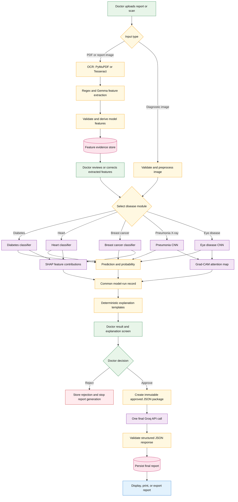

# MedSynapse Common Clinical Review Pipeline



## Implemented contract

1. Every prediction endpoint creates a `model_runs` row with status
   `awaiting_clinician_review`.
2. SHAP or Grad-CAM evidence is converted to readable sentences with deterministic
   templates. No LLM is called for this step.
3. The doctor can approve or reject the completed model run and attach a comment.
4. Rejected or pending runs cannot call the final-report endpoint.
5. An approved run is serialized with its prediction, exact explanation evidence,
   and clinician decision into one JSON package.
6. The final report-generation call uses Groq with a strict JSON schema. Its JSON
   structure is validated before it is stored in `final_reports`.
7. Once the final report is persisted, the model run is locked from further review.

## Shared API flow

```text
POST /api/predict/{module}
  -> model_run_id + prediction + clinical_report + awaiting_clinician_review

POST /api/model-runs/{model_run_id}/review
  -> approved or rejected clinician decision

POST /api/model-runs/{model_run_id}/final-report
  -> allowed only after approval; performs the Groq report call

GET /api/model-runs/{model_run_id}
  -> complete persisted audit record
```

The prediction routes currently covered are diabetes, heart, breast cancer,
pneumonia X-ray, and eye disease. Database-backed diabetes, breast-cancer, and
X-ray inference routes use the same post-model review pipeline.
