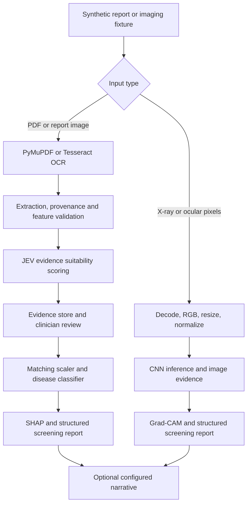

# MedSynapse complete pipeline verification

Run started: `2026-10-08T10:55:34.200993+00:00` (UTC).
Checkout: `feature/model_refinement` at `1332b3b43e7df9baea8bb70e56441f8c0b8cb2d4`.

**53 checks passed, 10 failed, 38 blocked.**
Failures assert an intended behavior that the current implementation violates. Blockers identify dependencies, artifacts, extraction, or inference failures. Passing an error-handling check does not make the disease pipeline operational.

## Scope and reproduction

```bash
venv/bin/python scripts/test_complete_pipeline.py
```

The runner creates six synthetic clinical source reports (diabetes high/low, heart, breast, pneumonia, eye), each as TXT, text PDF, PNG and scanned PDF, plus image-model fixtures. It calls the real FastAPI app in process with its startup lifecycle, real model artifacts, local Gemma, OCR, SQLite and explanation adapters. No production model or patient database is altered. The test database and generated explanations live inside the run directory.

`httpx` and `reportlab` are test dependencies in addition to `requirements.txt`. Exit code 1 is intentional when any required check fails or is blocked. Each execution gets a new output directory; this Markdown file describes the latest execution.

Evidence: [output/pipeline_runs/20261008T105534201008Z/results.json](output/pipeline_runs/20261008T105534201008Z/results.json). Fixtures: `output/pipeline_runs/20261008T105534201008Z/fixtures/`. Successful screening reports: `output/pipeline_runs/20261008T105534201008Z/clinical_reports/`. Isolated SQLite database: `output/pipeline_runs/20261008T105534201008Z/test.sqlite3`.

These fixtures establish software behavior only. There are no labelled patient cohorts, so these results do not establish sensitivity, specificity, calibration or diagnostic accuracy. Image-model inputs are synthetic. The test covers backend API/service behavior and the documented frontend value-transfer contract; browser interaction, print/export layout and clinician workflow usability are not exercised.

A supplemental local Gemma diagnostic used a longer timeout without changing the application's settings. Reproduce both default checks and retries with:

```bash
venv/bin/python scripts/test_complete_pipeline.py --retry-gemma-timeout 120
```

## Intended pipeline



## Per-module results

| Module | Inference | Verification state |
|---|---|---|
| diabetes | Inference returned a real prediction; full pipeline partial | {'PASS': 20, 'BLOCKED': 15, 'FAIL': 1} |
| heart | Inference returned a real prediction; full pipeline partial | {'PASS': 9, 'FAIL': 3, 'BLOCKED': 9} |
| breast | Model inference blocked | {'BLOCKED': 5, 'PASS': 9, 'FAIL': 2} |
| pneumonia | Inference returned a real prediction; full pipeline partial | {'PASS': 10, 'BLOCKED': 6, 'FAIL': 1} |
| eye | Model inference blocked | {'PASS': 3, 'BLOCKED': 3} |

Module counts include companion-report ingestion checks as well as model stages. Tesseract failures for an imaging module's companion report do not prevent its direct image classifier from running. Required inference, feature fidelity, evidence, and explanation stages must all succeed before a complete pipeline is claimed.

### Actual model outputs

| Module | Input path | Predicted class | Positive-class probability | Risk tier |
|---|---|---|---|---|
| diabetes | diabetes explicit form prediction | 1 | 0.7011 | High Risk |
| diabetes | diabetes OCR transfer prediction | 1 | 0.7011 | High Risk |
| diabetes | diabetes_low explicit form prediction | 0 | 0.0071 | Low Risk |
| diabetes | diabetes_low OCR transfer prediction | 0 | 0.0071 | Low Risk |
| heart | heart explicit form prediction | 0 | 0.0 | Low Risk |
| heart | heart OCR transfer prediction | 0 | 0.2 | Low Risk |
| pneumonia | image prediction | 1 | 0.8446 | High Risk |
| pneumonia | stored image replay | 1 | 0.8446 | High Risk |

### Diabetes: intended versus current

**Intended:** PDF/image -> OCR -> seven validated Gemma fields -> BMI_Cat -> SQLite -> clinician review -> matching eight-feature scaler/ensemble -> SHAP -> clinical report -> optional narrative. Legacy review/form path uses DPF and nine features.

- Image OCR Error: tesseract is not installed or it's not in your PATH. See README file for more information.
- PDF Extraction Error: tesseract is not installed or it's not in your PATH. See README file for more information.
- unavailable; missing=[]; Gemma service returned an unreadable response
- HTTP 409: Stored features are incomplete or require clinician review before inference.
- SHAP PermutationExplainer (full diabetes voting ensemble): Reference background data is missing: diabetes_background_scaled_9.npy. Export it during model training.
- Expected HTTP 422 for missing measurements; actual HTTP 200
- HTTP 503: LLM is not configured. Set LLM_API_URL, LLM_API_KEY, and LLM_MODEL.
- GemmaServiceError: Gemma returned an invalid diabetes extraction: Pregnancies has a value but status is 'missing'; remove the value or use 'extracted'

### Heart: intended versus current

**Intended:** PDF/image -> OCR -> validated 13-feature extraction -> SQLite evidence -> clinician review -> 13 ordered inputs -> scaler -> heart classifier -> SHAP -> clinical report -> optional narrative.

- Mismatched values: {'oldpeak': {'expected': 2.6, 'actual': 0.8}, 'ca': {'expected': 2, 'actual': 0}, 'thal': {'expected': 3, 'actual': 2}}
- Image OCR Error: tesseract is not installed or it's not in your PATH. See README file for more information.
- PDF Extraction Error: tesseract is not installed or it's not in your PATH. See README file for more information.
- unavailable; missing=[]; Gemma service returned an unreadable response
- No heart/from-feature-store endpoint is registered; frontend transfers legacy ready_inputs to the direct heart endpoint
- SHAP TreeExplainer: Install the optional 'shap' package to compute tabular explanations.
- {'oldpeak': {'expected': 2.6, 'actual': 0.8}, 'ca': {'expected': 2, 'actual': 0}, 'thal': {'expected': 3, 'actual': 2}}
- Expected HTTP 422 for missing measurements; actual HTTP 200
- HTTP 503: LLM is not configured. Set LLM_API_URL, LLM_API_KEY, and LLM_MODEL.
- GemmaServiceError: Gemma service returned an unreadable response

### Breast: intended versus current

**Intended:** FNA/pathology PDF/image -> OCR -> 30 labelled WDBC features (deterministic extraction, Gemma fallback) -> SQLite -> clinician review -> scaler -> PCA -> classifier -> SHAP -> clinical report.

- FileNotFoundError: Breast-cancer tabular artifacts are unavailable: model, scaler, pca. Train/export breast_cancer_model.pkl, breast_cancer_scaler.pkl, and breast_cancer_pca.pkl first.
- Image OCR Error: tesseract is not installed or it's not in your PATH. See README file for more information.
- PDF Extraction Error: tesseract is not installed or it's not in your PATH. See README file for more information.
- load_model_features returned features while clinician_approval_status=pending
- HTTP 503: Breast-cancer tabular artifacts are unavailable: model, scaler, pca. Train/export breast_cancer_model.pkl, breast_cancer_scaler.pkl, and breast_cancer_pca.pkl first.
- Invalid evidence in 30 fields (first 3): {'radius_mean': {'page': 5, 'source_text': 'radius_mean: 14.2'}, 'texture_mean': {'page': 6, 'source_text': 'texture_mean: 20.1'}, 'perimeter_mean': {'page': 7, 'source_text': 'perimeter_mean: 92.5'}}

### Pneumonia: intended versus current

**Intended:** Chest X-ray image (not report text) -> RGB 224x224 float32 pixels /255 -> CNN -> image/evidence storage -> Grad-CAM -> clinical report; stored image can be replayed.

- Image OCR Error: tesseract is not installed or it's not in your PATH. See README file for more information.
- PDF Extraction Error: tesseract is not installed or it's not in your PATH. See README file for more information.
- Grad-CAM: Grad-CAM computation failed: 'list' object has no attribute 'shape'
- Stored image replay returned HTTP 200 with approval still pending
- HTTP 503: LLM is not configured. Set LLM_API_URL, LLM_API_KEY, and LLM_MODEL.

### Eye: intended versus current

**Intended:** Ocular image (not report text) -> RGB 224x224 float32 pixels /255 -> trained ocular CNN with verified labels -> Grad-CAM -> clinical report.

- Image OCR Error: tesseract is not installed or it's not in your PATH. See README file for more information.
- PDF Extraction Error: tesseract is not installed or it's not in your PATH. See README file for more information.
- HTTP 503: Model artifact not found: models/eye_disease.keras. Train/export the eye_disease model before inference.

## Source-level causes and next fixes

These links identify the implemented boundaries inspected during this audit. The outcome matrix below supplies the runtime evidence.

| Boundary | Current implementation | Required follow-through |
|---|---|---|
| Report OCR | [ocr_service.py](backend/services/ocr_service.py) invokes system Tesseract for PNG/scanned PDF | Install/configure the Tesseract executable; its Python wrapper alone is insufficient. |
| OCR-to-form transfer | [ocr_service.py](backend/services/ocr_service.py) builds `ready_inputs` with defaults, while [OCRScannerView.jsx](frontend/src/components/OCRScannerView.jsx) transfers them to forms | Preserve explicit report values, expose missing values, and require review before inference; compare heart fields against the fixture. |
| Extraction provenance | [breast_feature_contract.py](backend/services/breast_feature_contract.py) sets `page=line_number` for labelled text | Retain actual document page metadata. All generated text reports here have one page. |
| Manual input validation | [main.py](backend/main.py) gives defaults to every diabetes/heart field | Reject missing measurements or require explicit review; an empty JSON request currently represents invented form inputs. |
| Diabetes feature width | [model_service.py](backend/services/model_service.py) loads `diabetes_model.pkl`/`diabetes_scaler.pkl`; store route expects eight features | Train/export and load compatible DPF-free artifacts; keep the nine-field legacy endpoint contract aligned. |
| Gemma | [gemma_service.py](backend/services/gemma_service.py) uses the configured request timeout | Examine the recorded request duration/error. Any extended-timeout diagnostic is separate from the default runtime result. |
| Eye / breast artifacts | [model_service.py](backend/services/model_service.py) lazy-loads ocular CNN or breast classifier/scaler/PCA | Supply trained artifacts with the exact required feature order and class mapping; rerun real inference. |
| Explainability | [explainability_service.py](backend/services/explainability_service.py) requires SHAP/reference cohorts or compatible CNN graph tensors | Supply the optional package/reference data and repair Grad-CAM tensor handling when its recorded error demands it. |
| Review enforcement | [database.py](backend/database.py) loaders check extraction readiness but do not read clinician approval | Add an approval transition and enforce it at the intended inference boundary if review must gate prediction. |
| OCR request errors | [main.py](backend/main.py) wraps all parse errors, including HTTPException, in HTTP 500 | Preserve intended 400 statuses; reject failed decode/OCR rather than treating an error string as report text. |
| Narrative | [clinical_report_service.py](backend/services/clinical_report_service.py) requires `LLM_API_URL`, `LLM_API_KEY`, `LLM_MODEL` | Configure a provider to verify optional narrative generation; no credentials are included in these outputs. |

## Exact stage outcomes

| Module | Stage | Status | Observed result |
|---|---|---|---|
| shared | create synthetic fixtures | PASS | Six reports; TXT/text PDF/PNG/scanned PDF; two image fixtures; all PDF text round-trips |
| diabetes | load artifacts | PASS | [{"type": "VotingClassifier", "n_features_in": 9, "classes": [0, 1]}, {"type": "StandardScaler", "n_features_in": 9, "classes": null}] |
| heart | load artifacts | PASS | [{"type": "RandomForestClassifier", "n_features_in": 13, "classes": [0, 1]}, {"type": "StandardScaler", "n_features_in": 13, "classes": null}] |
| breast | load artifacts | BLOCKED | FileNotFoundError: Breast-cancer tabular artifacts are unavailable: model, scaler, pca. Train/export breast_cancer_model.pkl, breast_cancer_scaler.pkl, and breast_cancer_pca.pkl first. |
| diabetes | diabetes text PDF | PASS | Extracted 406 characters; synthetic patient marker checked |
| diabetes | diabetes text PDF feature fidelity | PASS | Every predictor equals the fixture |
| diabetes | diabetes PNG OCR | BLOCKED | Image OCR Error: tesseract is not installed or it's not in your PATH. See README file for more information. |
| diabetes | diabetes scanned PDF OCR | BLOCKED | PDF Extraction Error: tesseract is not installed or it's not in your PATH. See README file for more information. |
| diabetes | diabetes_low text PDF | PASS | Extracted 404 characters; synthetic patient marker checked |
| diabetes | diabetes_low text PDF feature fidelity | PASS | Every predictor equals the fixture |
| diabetes | diabetes_low PNG OCR | BLOCKED | Image OCR Error: tesseract is not installed or it's not in your PATH. See README file for more information. |
| diabetes | diabetes_low scanned PDF OCR | BLOCKED | PDF Extraction Error: tesseract is not installed or it's not in your PATH. See README file for more information. |
| heart | heart text PDF | PASS | Extracted 562 characters; synthetic patient marker checked |
| heart | heart text PDF feature fidelity | FAIL | Mismatched values: {'oldpeak': {'expected': 2.6, 'actual': 0.8}, 'ca': {'expected': 2, 'actual': 0}, 'thal': {'expected': 3, 'actual': 2}} |
| heart | heart PNG OCR | BLOCKED | Image OCR Error: tesseract is not installed or it's not in your PATH. See README file for more information. |
| heart | heart scanned PDF OCR | BLOCKED | PDF Extraction Error: tesseract is not installed or it's not in your PATH. See README file for more information. |
| breast | breast text PDF | PASS | Extracted 848 characters; synthetic patient marker checked |
| breast | breast PNG OCR | BLOCKED | Image OCR Error: tesseract is not installed or it's not in your PATH. See README file for more information. |
| breast | breast scanned PDF OCR | BLOCKED | PDF Extraction Error: tesseract is not installed or it's not in your PATH. See README file for more information. |
| pneumonia | pneumonia text PDF | PASS | Extracted 291 characters; synthetic patient marker checked |
| pneumonia | pneumonia PNG OCR | BLOCKED | Image OCR Error: tesseract is not installed or it's not in your PATH. See README file for more information. |
| pneumonia | pneumonia scanned PDF OCR | BLOCKED | PDF Extraction Error: tesseract is not installed or it's not in your PATH. See README file for more information. |
| eye | eye text PDF | PASS | Extracted 287 characters; synthetic patient marker checked |
| eye | eye PNG OCR | BLOCKED | Image OCR Error: tesseract is not installed or it's not in your PATH. See README file for more information. |
| eye | eye scanned PDF OCR | BLOCKED | PDF Extraction Error: tesseract is not installed or it's not in your PATH. See README file for more information. |
| diabetes | PDF upload extraction | PASS | HTTP 200; extracted_count=11 |
| diabetes | validated extraction | BLOCKED | unavailable; missing=[]; Gemma service returned an unreadable response |
| diabetes | extraction persisted | PASS | Stored row disease/status/approval/digest: ('diabetes', 'unavailable', 'pending', '8a2a8f5cf1cff009189e23bf56651912e5998e78276b0df8020ad4ded7ac3862') |
| diabetes | uploaded report store prediction | BLOCKED | HTTP 409: Stored features are incomplete or require clinician review before inference. |
| heart | PDF upload extraction | PASS | HTTP 200; extracted_count=11 |
| heart | validated extraction | BLOCKED | unavailable; missing=[]; Gemma service returned an unreadable response |
| heart | extraction persisted | PASS | Stored row disease/status/approval/digest: ('heart', 'unavailable', 'pending', '7323cb0fad8d285254402007ae2019adce51fef9f266f829bdd9620f7ea33286') |
| heart | store prediction route | BLOCKED | No heart/from-feature-store endpoint is registered; frontend transfers legacy ready_inputs to the direct heart endpoint |
| breast | PDF upload extraction | PASS | HTTP 200; extracted_count=30 |
| breast | validated extraction | PASS | ready_for_inference; missing=[]; All 30 WDBC FNA features were extracted from explicit OCR labels; doctor approval is still required. |
| breast | validated feature fidelity | PASS | All validated values equal fixture |
| breast | extraction persisted | PASS | Stored row disease/status/approval/digest: ('breast', 'ready_for_inference', 'pending', '3eb802c9fbe4fc10e552a66bed18cdc41d210bd68fc78e54dfeab45b3fc6b215') |
| breast | storage round trip | PASS | Stored features match extracted features |
| breast | pending approval blocks store read | FAIL | load_model_features returned features while clinician_approval_status=pending |
| breast | uploaded report store prediction | BLOCKED | HTTP 503: Breast-cancer tabular artifacts are unavailable: model, scaler, pca. Train/export breast_cancer_model.pkl, breast_cancer_scaler.pkl, and breast_cancer_pca.pkl first. |
| diabetes | diabetes explicit form prediction | PASS | HTTP 200; class=1; probability=0.7011 |
| diabetes | diabetes explicit form prediction structured report | PASS | Report, decision trace, probability and review flag agree with model output |
| diabetes | diabetes explicit form prediction explanation | BLOCKED | SHAP PermutationExplainer (full diabetes voting ensemble): Reference background data is missing: diabetes_background_scaled_9.npy. Export it during model training. |
| diabetes | diabetes transferred feature fidelity | PASS | Form transfer equals report |
| diabetes | diabetes OCR transfer prediction | PASS | HTTP 200; class=1; probability=0.7011 |
| diabetes | diabetes OCR transfer prediction structured report | PASS | Report, decision trace, probability and review flag agree with model output |
| diabetes | diabetes OCR transfer prediction explanation | BLOCKED | SHAP PermutationExplainer (full diabetes voting ensemble): Reference background data is missing: diabetes_background_scaled_9.npy. Export it during model training. |
| diabetes | diabetes_low explicit form prediction | PASS | HTTP 200; class=0; probability=0.0071 |
| diabetes | diabetes_low explicit form prediction structured report | PASS | Report, decision trace, probability and review flag agree with model output |
| diabetes | diabetes_low explicit form prediction explanation | BLOCKED | SHAP PermutationExplainer (full diabetes voting ensemble): Reference background data is missing: diabetes_background_scaled_9.npy. Export it during model training. |
| diabetes | diabetes_low transferred feature fidelity | PASS | Form transfer equals report |
| diabetes | diabetes_low OCR transfer prediction | PASS | HTTP 200; class=0; probability=0.0071 |
| diabetes | diabetes_low OCR transfer prediction structured report | PASS | Report, decision trace, probability and review flag agree with model output |
| diabetes | diabetes_low OCR transfer prediction explanation | BLOCKED | SHAP PermutationExplainer (full diabetes voting ensemble): Reference background data is missing: diabetes_background_scaled_9.npy. Export it during model training. |
| heart | heart explicit form prediction | PASS | HTTP 200; class=0; probability=0.0 |
| heart | heart explicit form prediction structured report | PASS | Report, decision trace, probability and review flag agree with model output |
| heart | heart explicit form prediction explanation | BLOCKED | SHAP TreeExplainer: Install the optional 'shap' package to compute tabular explanations. |
| heart | heart transferred feature fidelity | FAIL | {'oldpeak': {'expected': 2.6, 'actual': 0.8}, 'ca': {'expected': 2, 'actual': 0}, 'thal': {'expected': 3, 'actual': 2}} |
| heart | heart OCR transfer prediction | PASS | HTTP 200; class=0; probability=0.2 |
| heart | heart OCR transfer prediction structured report | PASS | Report, decision trace, probability and review flag agree with model output |
| heart | heart OCR transfer prediction explanation | BLOCKED | SHAP TreeExplainer: Install the optional 'shap' package to compute tabular explanations. |
| breast | explicit 30-feature prediction | BLOCKED | HTTP 503: Breast-cancer tabular artifacts are unavailable: model, scaler, pca. Train/export breast_cancer_model.pkl, breast_cancer_scaler.pkl, and breast_cancer_pca.pkl first. |
| diabetes | legacy mismatch refused safely | PASS | HTTP 409: The installed diabetes artifact requires 9 features, including DiabetesPedigreeFunction. It cannot use the DPF-free local feature store. Install the retrained 8-feature artifact first. |
| pneumonia | image preprocessing | PASS | shape=(1, 224, 224, 3); dtype=float32; range=0.0588..0.5098 |
| pneumonia | image prediction | PASS | HTTP 200; class=1; probability=0.8446 |
| pneumonia | image prediction structured report | PASS | Report, decision trace, probability and review flag agree with model output |
| pneumonia | image prediction explanation | BLOCKED | Grad-CAM: Grad-CAM computation failed: 'list' object has no attribute 'shape' |
| pneumonia | stored image replay | PASS | HTTP 200; class=1; probability=0.8446 |
| pneumonia | stored image replay structured report | PASS | Report, decision trace, probability and review flag agree with model output |
| pneumonia | stored image replay explanation | BLOCKED | Grad-CAM: Grad-CAM computation failed: 'list' object has no attribute 'shape' |
| pneumonia | replay prediction matches | PASS | Original and stored-image outputs match exactly |
| pneumonia | pending approval blocks replay | FAIL | Stored image replay returned HTTP 200 with approval still pending |
| eye | image preprocessing | PASS | shape=(1, 224, 224, 3); dtype=float32; range=0.0000..0.8980 |
| eye | image prediction | BLOCKED | HTTP 503: Model artifact not found: models/eye_disease.keras. Train/export the eye_disease model before inference. |
| shared | missing upload rejected | FAIL | Expected HTTP 400; actual HTTP 500; {'detail': 'OCR processing failed: 400: Please upload a file or provide report text.'} |
| shared | empty upload rejected | FAIL | Expected HTTP 400; actual HTTP 500; {'detail': 'OCR processing failed: 400: Uploaded file is empty.'} |
| shared | invalid report image rejected | FAIL | Expected HTTP 400; actual HTTP 200; {'success': True, 'filename': 'bad.png', 'raw_text': 'Image OCR Error: cannot identify image file <_io.BytesIO object at 0x7fbe80c01580>', 'line_count': 1, 'extracted_count': 0, 'parameters': {}, 'feature_resolution_log': [], 'ready_inputs': {'diabetes': {'pregnancies': 0, 'glucose': 110.0, 'blood_p |
| shared | unrelated text blocks extraction | PASS | HTTP 200; unrelated text has no complete WDBC model features |
| diabetes | empty form rejected | FAIL | Expected HTTP 422 for missing measurements; actual HTTP 200 |
| heart | empty form rejected | FAIL | Expected HTTP 422 for missing measurements; actual HTTP 200 |
| breast | incomplete WDBC rejected | PASS | Expected/actual HTTP 422/422 |
| pneumonia | empty image rejected | PASS | Expected/actual HTTP 400/400 |
| eye | empty image rejected | PASS | Expected/actual HTTP 400/400 |
| diabetes | missing store record | PASS | Expected/actual HTTP 404/404 |
| breast | missing store record | PASS | Expected/actual HTTP 404/404 |
| pneumonia | missing store record | PASS | Expected/actual HTTP 404/404 |
| diabetes | diabetes-diabetes explicit form prediction narrative | BLOCKED | HTTP 503: LLM is not configured. Set LLM_API_URL, LLM_API_KEY, and LLM_MODEL. |
| diabetes | diabetes-diabetes OCR transfer prediction narrative | BLOCKED | HTTP 503: LLM is not configured. Set LLM_API_URL, LLM_API_KEY, and LLM_MODEL. |
| diabetes | diabetes-diabetes_low explicit form prediction narrative | BLOCKED | HTTP 503: LLM is not configured. Set LLM_API_URL, LLM_API_KEY, and LLM_MODEL. |
| diabetes | diabetes-diabetes_low OCR transfer prediction narrative | BLOCKED | HTTP 503: LLM is not configured. Set LLM_API_URL, LLM_API_KEY, and LLM_MODEL. |
| heart | heart-heart explicit form prediction narrative | BLOCKED | HTTP 503: LLM is not configured. Set LLM_API_URL, LLM_API_KEY, and LLM_MODEL. |
| heart | heart-heart OCR transfer prediction narrative | BLOCKED | HTTP 503: LLM is not configured. Set LLM_API_URL, LLM_API_KEY, and LLM_MODEL. |
| pneumonia | pneumonia-image prediction narrative | BLOCKED | HTTP 503: LLM is not configured. Set LLM_API_URL, LLM_API_KEY, and LLM_MODEL. |
| pneumonia | pneumonia-stored image replay narrative | BLOCKED | HTTP 503: LLM is not configured. Set LLM_API_URL, LLM_API_KEY, and LLM_MODEL. |
| pneumonia | image evidence persisted | PASS | Original image bytes and SHA256 checked; actual approval=pending |
| breast | extraction evidence provenance | FAIL | Invalid evidence in 30 fields (first 3): {'radius_mean': {'page': 5, 'source_text': 'radius_mean: 14.2'}, 'texture_mean': {'page': 6, 'source_text': 'texture_mean: 20.1'}, 'perimeter_mean': {'page': 7, 'source_text': 'perimeter_mean: 92.5'}} |
| diabetes | extended timeout extraction diagnostic | BLOCKED | GemmaServiceError: Gemma returned an invalid diabetes extraction: Pregnancies has a value but status is 'missing'; remove the value or use 'extracted' |
| heart | extended timeout extraction diagnostic | BLOCKED | GemmaServiceError: Gemma service returned an unreadable response |
| diabetes | JEV evidence routing | PASS | status=ready_for_routing; suitability=0.9413; available=8/8; missing=[] |
| heart | JEV evidence routing | PASS | status=needs_more_evidence; suitability=0.6431; available=9/13; missing=['oldpeak', 'slope', 'ca', 'thal'] |
| breast | JEV evidence routing | PASS | status=ready_for_routing; suitability=1.0; available=30/30; missing=[] |

## Runtime and artifacts

```json
{
  "branch": "feature/model_refinement",
  "commit": "1332b3b43e7df9baea8bb70e56441f8c0b8cb2d4",
  "python": "3.11.16 (main, Sep 10 2026, 16:41:19) [GCC 16.2.1 20260810]",
  "versions": {
    "fastapi": "0.141.1",
    "tensorflow": "2.21.0",
    "scikit-learn": "1.8.0",
    "numpy": "2.4.6",
    "pymupdf": "1.28.2",
    "pytesseract": "0.3.13",
    "shap": "not installed",
    "httpx": "0.28.1",
    "reportlab": "5.0.1"
  },
  "artifacts": {
    "models/xrays_pneumonia.keras": {
      "bytes": 87104661,
      "sha256": "9e8b21745084c66c2d573e527dd880517486d867e6b67bfbdb5669bb46a60aa9"
    },
    "models/heart_model.pkl": {
      "bytes": 1220859,
      "sha256": "538a8be57470d690374a052c83023ed82110bec643c767021001b6f8bd157f55"
    },
    "models/heart_scaler.pkl": {
      "bytes": 914,
      "sha256": "2b1bb322781b2a17d312267af45c70997c472360b2a2d35486552bcca6a0e199"
    },
    "models/diabetes_model.pkl": {
      "bytes": 371901,
      "sha256": "b30588bce6db05a168cad918747da273a70abdf78232959e772c5ffbcc83b328"
    },
    "models/README.md": {
      "bytes": 649,
      "sha256": "d247e2cc49d5701b4603adc28ab0ff9a8dd1986532b8380a80a0795fe8a31f58"
    },
    "models/diabetes_scaler.pkl": {
      "bytes": 834,
      "sha256": "1d25a1bc04d8a1fd7a69ddb3419740ae2d5dc6beaa3825e091b14ce1b3428a8b"
    }
  },
  "routes": [
    "/api/health",
    "/api/sample-reports",
    "/api/ocr/parse-report",
    "/api/predict/diabetes",
    "/api/predict/diabetes/from-feature-store/{feature_extraction_id}",
    "/api/predict/heart",
    "/api/predict/xray",
    "/api/predict/xray/from-feature-store/{feature_extraction_id}",
    "/api/predict/eye",
    "/api/predict/breast-cancer",
    "/api/predict/breast-cancer/from-feature-store/{feature_extraction_id}",
    "/api/reports/generate-narrative"
  ],
  "gemma": {
    "configured": true,
    "model": "gemma3:4b",
    "timeout_seconds": 45.0
  },
  "tesseract": null,
  "diabetes": [
    {
      "type": "VotingClassifier",
      "n_features_in": 9,
      "classes": [
        0,
        1
      ]
    },
    {
      "type": "StandardScaler",
      "n_features_in": 9,
      "classes": null
    }
  ],
  "heart": [
    {
      "type": "RandomForestClassifier",
      "n_features_in": 13,
      "classes": [
        0,
        1
      ]
    },
    {
      "type": "StandardScaler",
      "n_features_in": 13,
      "classes": null
    }
  ],
  "health": {
    "status": "online",
    "system": "MedSynapse AI v2.0",
    "ocr_engine": "Tesseract OCR + PyMuPDF Active",
    "models": {
      "diabetes_model": true,
      "heart_model": true,
      "xray_pneumonia_model": true,
      "eye_disease_model": false,
      "breast_cancer_model": false
    }
  },
  "baseline_finished_at": "2026-10-08T10:58:40.534795+00:00",
  "gemma_retry_timeout_seconds": 120
}
```

## Interpretation and remaining integration boundaries

- Diabetes has two different contracts: direct/form inference uses nine fields including DPF; Gemma/database extraction produces eight without DPF. A 409 refusal of incompatible artifacts is correct protection, while the report-to-database prediction remains incomplete.
- Heart evidence is persisted, but there is no registered heart prediction endpoint consuming an extraction ID. The current frontend uses `ready_inputs`; value-fidelity checks expose any parser defaults replacing report values.
- Breast text extraction can complete without Gemma when all 30 WDBC labels are explicit. Prediction additionally requires the classifier, scaler and PCA artifacts. A missing artifact is not an extraction failure.
- Pneumonia and eye models consume images, not the narrative in their companion reports. Image preprocessing checks do not establish that the trained model or class mapping is correct.
- `requires_clinician_review` in a report is a flag, not proof of approval enforcement. Pending-record tests check the actual database/API behavior. There is no clinician approval mutation endpoint in this audit's route inventory.
- Health currently reports artifact existence; successful model deserialization and prediction are verified separately above.
- Optional explanations and narratives have their own results. A successful model prediction with an unavailable explanation is a partial pipeline, even if HTTP 200 is returned.
- MRI/brain tumor is excluded because the current backend registers no MRI prediction route. Eye and breast are included because their routes are integrated, even though their trained artifacts may be absent.
